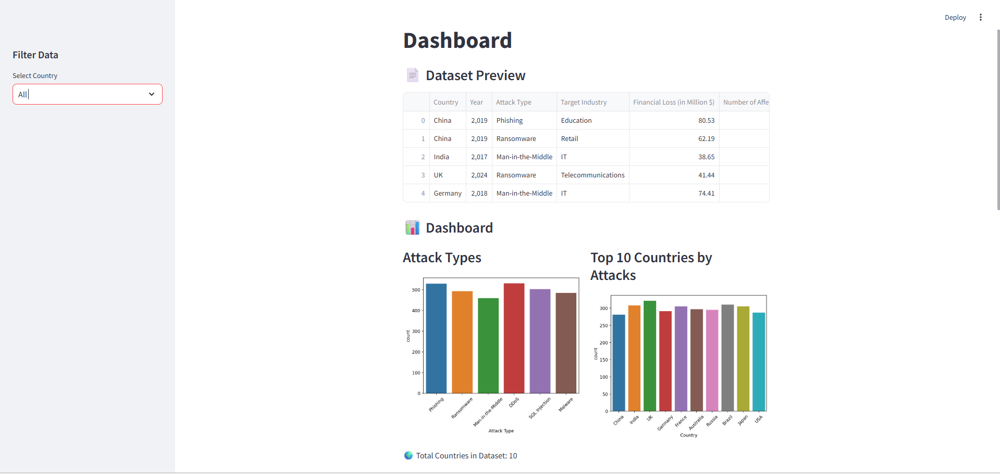
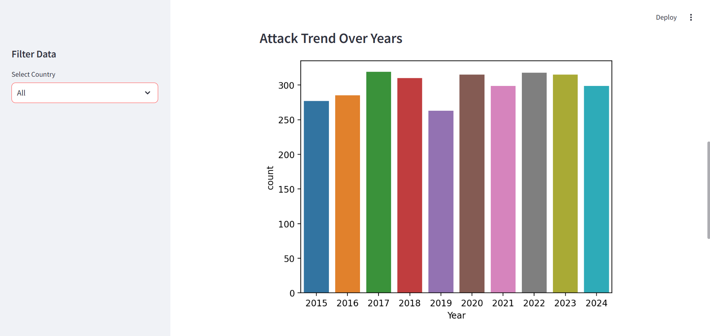
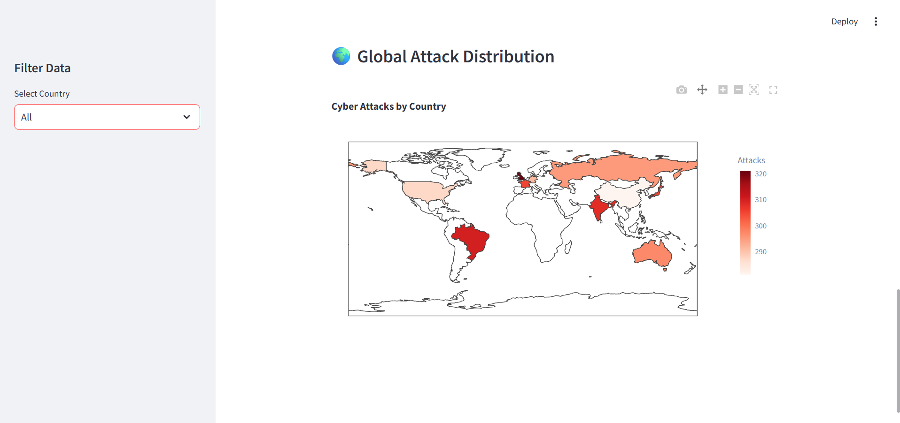

# 🌍 Global Cyber Attack Intelligence Dashboard

## 📌 Project Overview

This project is an interactive data visualization dashboard that analyzes global cyber attack data. It helps in understanding attack patterns, affected countries, and trends over time using visual insights.

---

## 🚀 Features

* 📊 Attack Type Analysis
* 🌍 Top 10 Countries Visualization
* 📈 Year-wise Attack Trends
* 🗺 Interactive World Map
* 🎛 Country-wise Filtering

---

## 🛠 Technologies Used

* **Python**
* **Pandas**
* **Seaborn**
* **Matplotlib**
* **Plotly**
* **Streamlit**

---

## 📂 Dataset

* Source: Kaggle
* Dataset: *Global Cybersecurity Threats (2015–2024)*

---

## ▶️ How to Run the Project

1. Clone the repository:

```
git clone https://github.com/pidishettysandhya1/global-cyber-attack-dashboard.git
```

2. Navigate to the project folder:

```
cd global-cyber-attack-dashboard
```

3. Install dependencies:

```
pip install pandas matplotlib seaborn plotly streamlit openpyxl
```

4. Run the application:

```
streamlit run app.py
```

---

## 🎯 Key Insights

* Identified most frequent cyber attack types
* Analyzed top affected countries
* Observed trends over multiple years
* Visualized global attack distribution

---

## 📸 Output

### Dashboard


### Charts


### World Map


---

## 👩‍💻 Author

**Sandhya Pidishetty**

---

## ⭐ Note

This project is built for learning and demonstrating data visualization and analytics skills.
